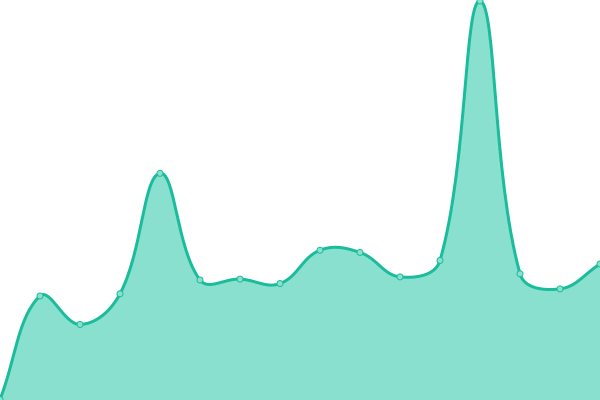

# [📈 Live Status](https://beta-status.triza.dev): <!--live status--> **🟨 Degraded performance**

This repository contains the open-source uptime monitor and status page for [T:Riza Corporation](https://beta-status.triza.dev), powered by [Upptime](https://github.com/upptime/upptime).

With [Upptime](https://upptime.js.org), you can get your own unlimited and free uptime monitor and status page, powered entirely by a GitHub repository. We use [Issues](https://github.com/TrizaCorporation/Status/issues) as incident reports, [Actions](https://github.com/TrizaCorporation/Status/actions) as uptime monitors, and [Pages](https://beta-status.triza.dev) for the status page.

<!--start: status pages-->
<!-- This summary is generated by Upptime (https://github.com/upptime/upptime) -->
<!-- Do not edit this manually, your changes will be overwritten -->
<!-- prettier-ignore -->
| URL | Status | History | Response Time | Uptime |
| --- | ------ | ------- | ------------- | ------ |
|  [T:Riza Site](https://www.triza.dev) | 🟩 Up | [t-riza-site.yml](https://github.com/TrizaCorporation/Status/commits/HEAD/history/t-riza-site.yml) | 

 351ms
     
 | 

<a href="https://status.triza.dev/history/t-riza-site">99.88%</a>
    

|  [T:Riza Api](https://api.triza.dev/v1/checkuptime) | 🟩 Up | [t-riza-api.yml](https://github.com/TrizaCorporation/Status/commits/HEAD/history/t-riza-api.yml) | 

 1387ms
     
 | 

<a href="https://status.triza.dev/history/t-riza-api">99.58%</a>
    

|  [RbxVeri](https://verify.triza.dev) | 🟨 Degraded | [rbx-veri.yml](https://github.com/TrizaCorporation/Status/commits/HEAD/history/rbx-veri.yml) | 

 2744ms
     
 | 

<a href="https://status.triza.dev/history/rbx-veri">99.94%</a>
    

|  [Roblox](https://www.roblox.com) | 🟩 Up | [roblox.yml](https://github.com/TrizaCorporation/Status/commits/HEAD/history/roblox.yml) | 

 497ms
     
 | 

<a href="https://status.triza.dev/history/roblox">99.63%</a>
    

|  [Roblox Group Api](https://groups.roblox.com/v1/groups/metadata) | 🟩 Up | [roblox-group-api.yml](https://github.com/TrizaCorporation/Status/commits/HEAD/history/roblox-group-api.yml) | 

 112ms
     
 | 

<a href="https://status.triza.dev/history/roblox-group-api">100.00%</a>
    

|  [Roblox TextFilter Api](https://textfilter.roblox.com) | 🟩 Up | [roblox-text-filter-api.yml](https://github.com/TrizaCorporation/Status/commits/HEAD/history/roblox-text-filter-api.yml) | 

 1170ms
     
 | 

<a href="https://status.triza.dev/history/roblox-text-filter-api">98.93%</a>
    

|  [Google](https://www.google.com) | 🟩 Up | [google.yml](https://github.com/TrizaCorporation/Status/commits/HEAD/history/google.yml) | 

 89ms
     
 | 

<a href="https://status.triza.dev/history/google">100.00%</a>
    

|  [Cloudflare](https://www.cloudflare.com) | 🟩 Up | [cloudflare.yml](https://github.com/TrizaCorporation/Status/commits/HEAD/history/cloudflare.yml) | 

 86ms
     
 | 

<a href="https://status.triza.dev/history/cloudflare">100.00%</a>
    

|  [Discord](https://discord.com) | 🟩 Up | [discord.yml](https://github.com/TrizaCorporation/Status/commits/HEAD/history/discord.yml) | 

 71ms
     
 | 

<a href="https://status.triza.dev/history/discord">100.00%</a>
    

<!--end: status pages-->

[**Visit our status website →**](https://beta-status.triza.dev)

## 📄 License

- Powered by: [Upptime](https://github.com/upptime/upptime)
- Code: [MIT](./LICENSE) © [T:Riza Corporation](https://beta-status.triza.dev)
- Data in the `./history` directory: [Open Database License](https://opendatacommons.org/licenses/odbl/1-0/)
